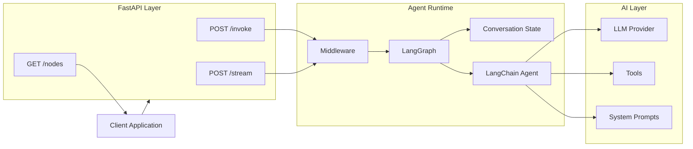

# LangChain–LangGraph Agent Template

<p align="center">
  <strong>Production-ready foundation for building modular, stateful, tool-enabled AI agents with LangChain, LangGraph, and FastAPI.</strong>
</p>

<p align="center">
  <a href="#"></a>
  <a href="#"></a>
  <a href="#"></a>
  <a href="#"></a>
  <a href="#"></a>
  <a href="#"></a>
</p>

---

## Overview

**LangChain–LangGraph Agent Template** is a modular backend foundation for building production-oriented AI agents and agentic applications.

It combines **LangChain** for LLM and tool integration, **LangGraph** for stateful agent orchestration, and **FastAPI** for exposing agents through scalable HTTP and streaming APIs.

The template is designed for teams building applications such as:

* AI copilots
* Enterprise assistants
* RAG applications
* Workflow automation agents
* Multi-step reasoning systems
* Tool-calling agents
* Internal AI platforms
* Domain-specific AI services

Its modular architecture makes agents, prompts, tools, middleware, runtime configuration, and API delivery independently extensible.

---

## Key Features

### Agent Architecture

* LangGraph-based stateful agent workflows
* Modular agent and node definitions
* Easy registration of additional agents
* Dedicated system prompts for individual agents
* Conversation state management
* Extensible graph architecture

### Tool Integration

* Pluggable LangChain tools
* Runtime tool access
* Clean separation between agents and tool implementations
* Easy integration with APIs, databases, search systems, and internal services

### Conversation Management

* Stateful conversations
* Optional conversation summarization
* Context-aware agent execution
* Configurable middleware pipeline

### API Layer

* FastAPI-based HTTP server
* Standard invocation endpoint
* Streaming agent responses
* Agent/node discovery endpoint
* Automatic Swagger/OpenAPI documentation

### Production-Oriented Design

* Environment-based configuration
* Docker support
* Modular project structure
* Optional request/response logging
* Optional LLM retry behavior
* Centralized settings
* Separation of prompts, tools, agents, and infrastructure

---

## Architecture



### Request Flow

```text
Client
   │
   ▼
FastAPI
   │
   ▼
Middleware
   │
   ▼
LangGraph
   │
   ├── Conversation State
   │
   ├── Agent Node
   │
   └── Tool Execution
          │
          ▼
     LLM / External Services
          │
          ▼
      Final Response
```

The API receives a user request and forwards it through the runtime middleware into the LangGraph workflow.

LangGraph maintains execution state and determines which node should execute. The selected agent can communicate with the configured LLM, access tools, use conversation context, and return either a normal or streamed response.

---

## Technology Stack

| Layer               | Technology        |
| ------------------- | ----------------- |
| Agent Framework     | LangChain         |
| Agent Orchestration | LangGraph         |
| API Framework       | FastAPI           |
| Runtime             | Python            |
| Package Management  | `uv`              |
| LLM Provider        | OpenAI            |
| Deployment          | Docker            |
| API Documentation   | OpenAPI / Swagger |

---

## Project Structure

```text
.
├── main.py
│
├── src/
│   ├── core/
│   │   ├── constants.py
│   │   ├── settings.py
│   │   ├── context.py
│   │   └── middleware.py
│   │
│   ├── agent/
│   │   ├── state.py
│   │   ├── agents.py
│   │   ├── nodes.py
│   │   └── graph.py
│   │
│   ├── tools/
│   │   └── ...
│   │
│   └── prompts/
│       ├── assistant.md
│       └── ...
│
├── docs/
│   ├── architecture.md
│   └── guide.md
│
├── .env.example
├── Dockerfile
├── pyproject.toml
└── README.md
```

### Directory Responsibilities

| Directory      | Responsibility                                                    |
| -------------- | ----------------------------------------------------------------- |
| `src/core/`    | Configuration, runtime context, constants, and middleware         |
| `src/agent/`   | Agent definitions, graph nodes, state, and workflow orchestration |
| `src/tools/`   | LangChain-compatible tools available to agents                    |
| `src/prompts/` | Agent-specific system prompts                                     |
| `docs/`        | Architecture and developer documentation                          |

---

## Prerequisites

Before running the application, ensure the following are installed:

* **Python 3.11+**
* **uv**
* **Git**
* **Docker** — optional
* Valid **OpenAI API key**

Recommended development environment:

| Resource | Recommendation                      |
| -------- | ----------------------------------- |
| CPU      | 2+ cores                            |
| RAM      | 4 GB minimum                        |
| Storage  | 1 GB+ available                     |
| Network  | Internet access for hosted LLM APIs |

> Resource requirements may increase depending on the number of agents, external tools, concurrent requests, and model provider.

---

## Quick Start

### 1. Clone the Repository

```bash
git clone <your-repository-url>
cd <repository-name>
```

### 2. Install Dependencies

```bash
uv sync
```

### 3. Configure Environment

Copy the example environment configuration:

```bash
cp .env.example .env
```

Add your OpenAI API key:

```env
OPENAI_API_KEY=sk-...
```

### 4. Start the API Server

```bash
uv run uvicorn main:app --reload --port 8000
```

The application will be available at:

```text
http://localhost:8000
```

---

## API Documentation

FastAPI automatically exposes interactive API documentation.

Once the server is running:

```text
Swagger UI:
http://localhost:8000/docs

OpenAPI Schema:
http://localhost:8000/openapi.json
```

---

## API Usage

### Invoke an Agent

```bash
curl -X POST http://localhost:8000/invoke \
  -H "Content-Type: application/json" \
  -d '{
    "message": "Hello",
    "node": "assistant"
  }'
```

Example request:

```json
{
  "message": "Explain retrieval-augmented generation.",
  "node": "assistant"
}
```

---

### Stream a Response

```bash
curl -X POST http://localhost:8000/stream \
  -H "Content-Type: application/json" \
  -d '{
    "message": "Explain LangGraph step by step.",
    "node": "assistant"
  }'
```

The streaming endpoint is useful for:

* Chat interfaces
* AI copilots
* Long-running generations
* Real-time user experiences

---

### List Available Nodes

```bash
curl http://localhost:8000/nodes
```

This endpoint exposes the currently registered agent nodes.

---

## Configuration

Application behavior is controlled through environment variables.

Example `.env`:

```env
OPENAI_API_KEY=sk-...

ENV=LOCAL

ENABLE_SUMMARIZATION=true
ENABLE_RETRY=false
ENABLE_LOGGING=false
```

### Environment Variables

| Variable               | Required | Default | Description                                           |
| ---------------------- | :------: | ------- | ----------------------------------------------------- |
| `OPENAI_API_KEY`       |    Yes   | —       | API key used to access OpenAI models                  |
| `ENV`                  |    No    | `LOCAL` | Runtime environment such as `LOCAL`, `DEV`, or `PROD` |
| `ENABLE_SUMMARIZATION` |    No    | `true`  | Enables automatic conversation summarization          |
| `ENABLE_RETRY`         |    No    | `false` | Enables retry behavior for failed LLM requests        |
| `ENABLE_LOGGING`       |    No    | `false` | Enables request and response logging                  |

> Never commit production API keys or secrets to source control.

---

# Extending the Agent Platform

The project is intentionally designed so new agents can be introduced without restructuring the application.

## Adding a New Agent

### 1. Register the Node

Add the agent name to:

```text
src/core/constants.py
```

Example:

```python
NODES = [
    "assistant",
    "researcher",
]
```

### 2. Define the Agent

Create the agent configuration inside:

```text
src/agent/agents.py
```

### 3. Create the Graph Node

Add its execution node inside:

```text
src/agent/nodes.py
```

### 4. Add the System Prompt

Create:

```text
src/prompts/researcher.md
```

### 5. Register the Node in the Graph

Connect the node to the required LangGraph workflow.

For additional implementation details, see:

```text
docs/guide.md
```

---

## Adding Tools

Tools should be implemented inside:

```text
src/tools/
```

A standard LangChain tool can then be registered with the appropriate agent.

Example:

```python
from langchain_core.tools import tool


@tool
def get_customer(customer_id: str) -> dict:
    """Retrieve customer information."""

    return {
        "customer_id": customer_id,
        "status": "active",
    }
```

Agents can then be configured with the tools they are permitted to access.

This approach keeps:

```text
Agent Reasoning
      │
      ▼
Tool Selection
      │
      ▼
Tool Runtime
      │
      ▼
External API / Database / Service
```

cleanly separated.

---

## Prompt Management

Each agent can maintain an independent system prompt.

```text
src/prompts/
├── assistant.md
├── researcher.md
├── analyst.md
└── support.md
```

This allows agent behavior to evolve independently from application logic.

Recommended prompt responsibilities include:

* Agent role
* Behavioral constraints
* Tool usage instructions
* Output format
* Business rules
* Safety constraints
* Domain context

---

## Conversation Memory

The runtime supports conversation state that can be passed through LangGraph.

When enabled:

```env
ENABLE_SUMMARIZATION=true
```

long conversations can be summarized to help reduce unnecessary context growth while retaining important conversational information.

---

# Docker Deployment

## Build the Image

```bash
docker build -t langgraph-agent .
```

## Run the Container

```bash
docker run \
  -p 8000:8000 \
  --env-file .env \
  langgraph-agent
```

The API will be available at:

```text
http://localhost:8000
```

---

## Production Deployment

For production environments, consider running the container behind infrastructure such as:

```text
Internet / Internal Network
            │
            ▼
     Load Balancer
            │
            ▼
     Reverse Proxy
            │
            ▼
       FastAPI API
            │
            ▼
      LangGraph Runtime
            │
       ┌────┴────┐
       ▼         ▼
   LLM APIs    Tools
                  │
                  ▼
          Internal Services
```

Production environments should additionally consider:

* HTTPS/TLS termination
* Authentication and authorization
* Secret management
* Centralized logging
* Observability and tracing
* Request rate limits
* API timeouts
* Health checks
* Horizontal scaling
* Database-backed checkpointing
* Persistent conversation state
* LLM usage and cost monitoring

---

# Security

AI applications should treat prompts, model responses, tool calls, API credentials, and external data as potentially sensitive resources.

Recommended security practices include:

* Never commit `.env` files
* Store secrets in a secure secret manager
* Validate API inputs
* Validate tool arguments
* Restrict tool permissions
* Apply least-privilege access
* Authenticate production API endpoints
* Sanitize external tool outputs
* Protect against prompt injection
* Implement request rate limiting
* Log security-relevant events
* Apply dependency vulnerability scanning

For production deployments, security controls should be implemented according to the organization's infrastructure and compliance requirements.

If a `SECURITY.md` file is maintained, security vulnerabilities should be reported according to the process documented there.

---

## Observability

Production agent systems should provide visibility into both application behavior and LLM behavior.

Useful metrics include:

* Request latency
* LLM latency
* Token consumption
* Tool execution duration
* Tool failures
* Model failures
* Agent execution paths
* Retry counts
* API error rates
* Cost per request

The existing middleware architecture can be extended with observability platforms as required.

---

## Development

Start the development server with hot reload:

```bash
uv run uvicorn main:app --reload --port 8000
```

Recommended development workflow:

```text
Create Feature
     │
     ▼
Add / Update Agent
     │
     ▼
Add Tools
     │
     ▼
Update Prompt
     │
     ▼
Test Locally
     │
     ▼
Test API
     │
     ▼
Build Docker Image
     │
     ▼
Deploy
```

---

## Documentation

Additional documentation is available under the `docs/` directory.

| Document                                       | Description                                |
| ---------------------------------------------- | ------------------------------------------ |
| [`docs/architecture.md`](docs/architecture.md) | Detailed system architecture               |
| [`docs/guide.md`](docs/guide.md)               | Developer guide and extension instructions |

---

## Roadmap

Potential future extensions include:

* [ ] Persistent LangGraph checkpoints
* [ ] Multiple LLM providers
* [ ] Agent routing
* [ ] Multi-agent workflows
* [ ] Retrieval-Augmented Generation
* [ ] Vector database integration
* [ ] Human-in-the-loop workflows
* [ ] Authentication and authorization
* [ ] OpenTelemetry tracing
* [ ] LLM cost tracking
* [ ] Kubernetes deployment manifests
* [ ] CI/CD pipelines
* [ ] Automated evaluation framework

---

## Contributing

Contributions are welcome.

A typical workflow is:

```bash
git checkout -b feature/your-feature
```

Make your changes and commit them:

```bash
git commit -m "feat: add new agent capability"
```

Push the branch:

```bash
git push origin feature/your-feature
```

Then open a pull request describing:

* What was changed
* Why the change is required
* How the change was tested
* Any architecture or API implications

For larger changes, consider documenting architectural decisions before implementation.

---

## Support

For implementation questions, bugs, and feature requests, use the repository's GitHub Issues section.

When reporting an issue, include:

* Environment
* Python version
* Relevant configuration
* Reproduction steps
* Expected behavior
* Actual behavior
* Relevant logs without credentials or secrets

Enterprise support, SLA commitments, and commercial support should only be documented here if they are actually provided by the organization maintaining this repository.

---

## License

Add the appropriate license for your project.

Common options include:

* Apache License 2.0
* MIT License
* Proprietary / Commercial License

See the repository's `LICENSE` file for the applicable terms.

---

## Why This Template?

Most AI prototypes tightly couple model calls, prompts, tools, application logic, and APIs.

That approach becomes difficult to maintain as the system grows.

This template separates those concerns:

```text
API
 │
 ├── Runtime / Middleware
 │
 ├── LangGraph Orchestration
 │
 ├── Agent Definitions
 │
 ├── Conversation State
 │
 ├── Prompts
 │
 └── Tools
```

The result is a cleaner foundation for evolving a basic LLM application into a maintainable **agent platform**.

---

<p align="center">
  <strong>Built with LangChain · LangGraph · FastAPI</strong>
</p>
